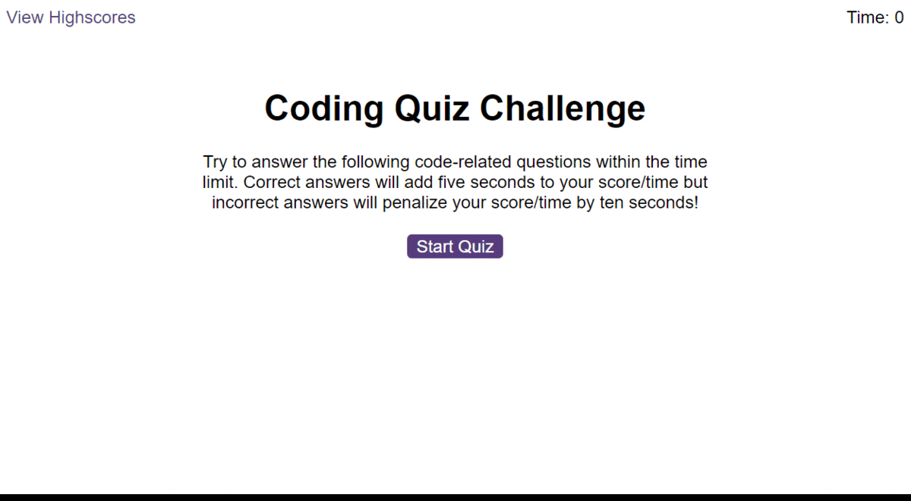

# Nebulus 60 Second Coding Quiz

Test your knowledge in JavaScript with the Nebulus 60 Second Coding Quiz.

## Description

This application is written in vanilla JavaScript and uses the browser's local storage for saving high scores.

## Features

- Dynamic Timer
- Incorrect answers reduce time by 10s
- Correct answers give +5s
- Audio and visual feedback
- High Score page

## Deployed

This app is deployed at the following URL:

https://willmowlam.github.io/nebulus-60-second-quiz/

